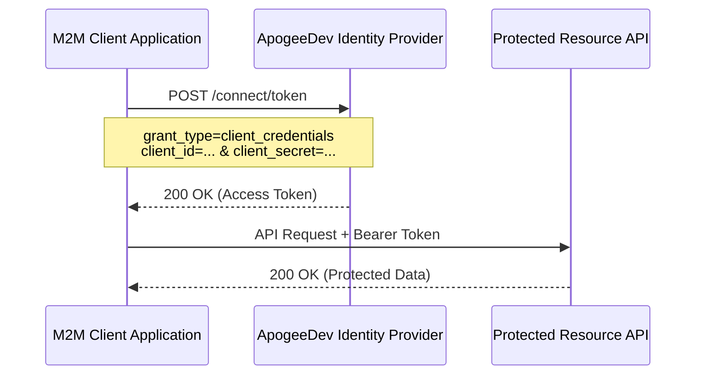

In our [previous deep dive](https://apogee-dev.com/blogs/custom-idp/), we explored the architecture of **ApogeeDev Identity Provider**, a custom enterprise-ready OIDC system built on ASP.NET Core, OpenIddict, and MongoDB. We focused heavily on securing user-facing applications using the Authorization Code flow with PKCE.

However, not all authentication involves a human user. In a microservices architecture, backend services, daemons, and background workers frequently need to securely communicate with one another. This is known as **Machine-to-Machine (M2M)** communication. 

To support M2M authentication without user intervention, we implemented the **OAuth 2.0 Client Credentials Flow**. In this follow-up, we'll walk through the architectural updates and code changes required to support this flow securely and efficiently.

## The Client Credentials Flow

Unlike the Authorization Code flow which requires browser redirects and user consent, the Client Credentials flow is entirely backend-to-backend. The client application authenticates directly with the Identity Provider using its own `client_id` and `client_secret` to obtain an access token.



## 1. Enabling the Flow in OpenIddict

First, we need to instruct OpenIddict to allow the Client Credentials grant type at the server level. We updated our `AuthServerExtension` to explicitly enable this flow alongside our existing configuration.

```csharp
// src/ApogeeDev.IdentityProvider.Host/Helpers/Authentication/AuthServerExtension.cs
services.AddOpenIddict()
    .AddServer(options =>
    {
        // ... existing configuration
        options.AllowAuthorizationCodeFlow()
               .AllowRefreshTokenFlow()
               .AllowClientCredentialsFlow(); // Enabled M2M Flow
        // ...
    });
```

## 2. Handling the Token Request

When a client application requests a token via the `/connect/token` endpoint, the request reaches our `OAuthController`. Since there is no user involved, we must construct a `ClaimsIdentity` that represents the application itself. 

Notice how we map the `ClientId` to both the `Subject` and `Name` claims. This is a critical distinction from user-centric flows.

```csharp
// src/ApogeeDev.IdentityProvider.Host/Controllers/OAuthController.cs
if (request.IsClientCredentialsGrantType())
{
    var identity = new ClaimsIdentity(
        OpenIddictServerAspNetCoreDefaults.AuthenticationScheme,
        Claims.Name,
        Claims.Role);

    // Client Credentials must map back to the Application Client ID as the Subject
    var clientId = request.ClientId ?? throw new InvalidOperationException("Client ID is missing.");
    identity.AddClaim(Claims.Subject, clientId);
    identity.AddClaim(Claims.Name, clientId);

    var claimsPrincipal = new ClaimsPrincipal(identity);
    
    // Apply requested scopes (e.g., API permissions)
    claimsPrincipal.SetScopes(request.GetScopes());

    return SignIn(claimsPrincipal, OpenIddictServerAspNetCoreDefaults.AuthenticationScheme);
}
```

## 3. Configuring M2M Clients and Permissions

A client utilizing the Client Credentials flow is inherently a **Confidential Client** (since it must securely store a secret) and typically represents a server-side application. Furthermore, it doesn't need interactive properties like Redirect URIs.

We updated our CQRS command handlers to automatically enforce these invariants. When creating or updating an application, we check if the selected `FlowType` is `client_credentials`:

```csharp
// src/ApogeeDev.IdentityProvider.Host/Operations/RequestHandlers/Models.cs
public static (IEnumerable<string>, IEnumerable<string>) MapRequirementPermissions(this AppClientData data)
{
    var permissions = new List<string>();
    var requirements = new List<string>();

    if (data.FlowType == OAuthFlowTypes.ClientCredentials)
    {
        // Grant endpoint and flow permissions natively
        permissions.Add(Permissions.Endpoints.Token);
        permissions.Add(Permissions.GrantTypes.ClientCredentials);
        permissions.Add(Permissions.Scopes.Roles);
    }
    else
    {
        // Handle Authorization Code permissions...
    }

    return (permissions, requirements);
}
```

In our command handler (`AppClientAddRequestHandler.cs`), we enforce the client type:

```csharp
if (request.Data.FlowType == OAuthFlowTypes.ClientCredentials)
{
    logger.LogInformation("Setting client type to confidential and application type to web for client credentials flow");
    clientType = ClientTypes.Confidential;
    applicationType = ApplicationTypes.Web;
}
```

## 4. Skipping Token Encryption (Interoperability & Performance)

By default, OpenIddict encrypts access tokens to produce JWE (JSON Web Encryption) tokens. While excellent for security over untrusted networks, this can present interoperability challenges. For instance, when using an M2M `access_token` to call AWS STS `AssumeRoleWithWebIdentity` to access AWS services, the token must be a standard JWS (JSON Web Signature). AWS cannot decrypt a JWE without access to your private key. Additionally, internal microservices communicating within a secure VPC might prefer the performance gain of skipping payload encryption (relying solely on TLS and JWT signatures).

We introduced a dynamic optimization using OpenIddict's event model. We created a `ConfigureAccessTokenEncryption` handler that intercepts the `ProcessSignInContext`. If a specific client has `SkipTokenEncryption` configured in its MongoDB properties, we disable encryption for its tokens on the fly, yielding a standard JWS.

```csharp
// src/ApogeeDev.IdentityProvider.Host/Helpers/Authentication/ConfigureAccessTokenEncryption.cs
public class ConfigureAccessTokenEncryption(OperationContext opContext, ILogger<ConfigureAccessTokenEncryption> logger)
    : IOpenIddictServerHandler<ProcessSignInContext>
{
    public const string SkipTokenEncryptionProp = "SkipTokenEncryption";
    
    public async ValueTask HandleAsync(ProcessSignInContext context)
    {
        if (context.AccessTokenPrincipal is not null && !string.IsNullOrWhiteSpace(context.Request.ClientId))
        {
            var app = await opContext.ApplicationManager.FindByClientIdAsync(context.Request.ClientId, context.CancellationToken);
            if (app is not null)
            {
                var properties = await opContext.ApplicationManager.GetPropertiesAsync(app, context.CancellationToken);
                
                // Dynamically alter encryption behavior for specific clients
                if(properties.TryGetValue(SkipTokenEncryptionProp, out var skipEncryptionValue) &&
                   skipEncryptionValue is JsonElement jsonElement &&
                   jsonElement.ValueKind == JsonValueKind.True)
                {
                    context.Options.DisableAccessTokenEncryption = true; 
                }
            }
        }
    }
}
```

This handler is injected directly into the OpenIddict pipeline just before the access token is generated:

```csharp
// In AuthServerExtension.cs
o.AddEventHandler<ProcessSignInContext>(builder =>
    builder.UseScopedHandler<ConfigureAccessTokenEncryption>()
           .SetOrder(OpenIddictServerHandlers.GenerateAccessToken.Descriptor.Order - 1));
```

## 5. UI Updates for the Admin Console

Finally, we updated our decoupled Vue 3 SPA management dashboard to support creating these M2M clients easily. We introduced a `FlowTypeSelect` component to toggle between flow types. 

When "Client Credentials" is selected, the UI intuitively hides irrelevant fields (like Redirect URIs and PKCE) and exposes the new "Disable Token Encryption" optimization toggle.


```vue
<!-- src/idp-manager-app/src/components/clients/ClientEdit.vue -->
<div class="mb-4" v-if="!isAuthCodeFlow">
  <label for="disable-token-encryption" class="form-label text-light">Disable Token Encryption</label>
  <input
    type="checkbox"
    id="disable-token-encryption"
    v-model="model.skipAccessTokenEncryption"
    class="form-check-input ms-3"
  />
</div>
```

## Summary

With these changes, **ApogeeDev Identity Provider** is now fully capable of securing complex microservice ecosystems. By supporting both user-interactive Authorization Code flows and headless Machine-to-Machine Client Credentials flows, we maintain absolute sovereignty over our identity architecture without compromising on flexibility or performance.
