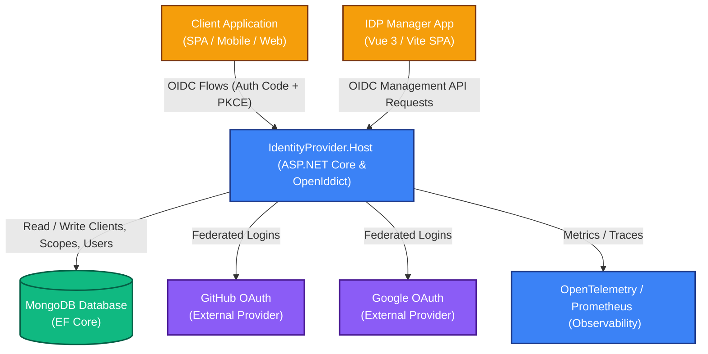

When securing an ecosystem of apps, the immediate impulse is often to outsource authentication to a SaaS identity provider. While this "buy" option works well initially, many organizations eventually hit a wall: ballooning active-user pricing, rigid multi-tenancy limits, complex data-residency compliance, or the inability to inject custom logic deep into the authentication pipeline.

To bypass these limitations entirely, I engineered **ApogeeDev Identity Provider**—an enterprise-ready, standards-compliant **OpenID Connect (OIDC) and OAuth 2.0 Identity Provider (IdP)**.

By building on top of the robust **OpenIddict** framework on **ASP.NET Core**, backing it with a production-tuned **MongoDB** datastore, and managing it with a decoupled **Vue 3 SPA**, this system achieves extreme architectural autonomy and elite performance.

In this deep dive, we will explore the architectural blueprint, dissect how we solved hard data-layer conflicts, and look under the hood of a production-ready modern identity system.

## **The System Architecture**

A reliable identity infrastructure must be highly available, deeply observable, and loosely coupled. ApogeeDev IdP achieves this by enforcing a strict separation of concerns between the core token issuer, persistent storage, federated log-ins, and the administrative console.

Here is how the system components interact:



### **1\. Decoupled CQRS via MediatR**

Inside the main backend host (ApogeeDev.IdentityProvider.Host), business logic is entirely separated from API endpoints and MVC controllers using the **CQRS (Command Query Responsibility Segregation)** pattern via **MediatR**.

When an OAuth exchange arrives, or a user changes their profile, controllers do not execute business logic directly. Instead, they dispatch a command to isolated RequestHandlers and Processors. This clean separation isolates the surface area of our MVC layers, making the core security rules incredibly simple to audit, write unit tests for, and maintain.

### **2\. Micro-Frontend Separation of Concerns**

The administrative management dashboard (idp-manager-app) is completely detached from the core backend. It is constructed as a decoupled Single Page Application (SPA) powered by **Vue 3 (using \<script setup\>)**, **Vite**, and **Pinia**.

It communicates with the host exclusively via secure, authorized OIDC Management API endpoints using the standardized oidc-client-ts library. By pulling administrative tools out of the high-throughput authentication engine, we minimize the attack surface of the authentication endpoint itself.

## **Fusing OIDC with MongoDB: Solving the Strong-Naming Conflict**

While relational databases (SQL Server, PostgreSQL) are the industry default for identity servers, document databases are a natural fit for security engines. Client definitions, claims arrays, dynamic scopes, and token metadata fit perfectly into MongoDB's flexible JSON-like document structures, enabling lightning-fast lookups and easy horizontal scaling.

Our backend interfaces with MongoDB using a hybrid of MongoDB.Driver and MongoDB.EntityFrameworkCore. However, aligning these dependencies introduced a major real-world technical hurdle during development.

### **The Strong-Naming Trap**

Beginning with version 2.28.0, the native assembly DLLs for MongoDB.Driver became **strong-named** by default. While this is generally positive for enterprise applications, it introduced a breaking change:

* The community integration library, OpenIddict.MongoDb, expected an un-strong-named driver reference or struggled to cast types correctly when mixed with the cutting-edge version of MongoDB.EntityFrameworkCore.  
* Compiling the host would throw runtime type-matching violations or fail during package restoration.

**The Resolution:** We conducted a systematic dependency pinning review. To maintain stability, we resolved the conflict by strictly locking our Entity Framework Core data layer dependencies to a stable, compatible version: **8.0.3**. This targeted pinning restored compilation compatibility without sacrificing the high-throughput index optimizations needed for the driver.

## **Security Practices Under the Hood**

### **1\. Hardening with Authorization Code \+ PKCE**

Public clients—like JavaScript SPAs, mobile applications, or desktop clients—cannot securely protect a static client secret. To protect our client applications, ApogeeDev IdP enforces **Authorization Code Flow with PKCE (Proof Key for Code Exchange)** alongside short-lived Refresh Tokens. This setup ensures that if an attacker intercepts an authorization code, they cannot exchange it for a token without the uniquely generated runtime cryptographic verifier.

### **2\. Eliminating Local Cert Friction with Cryptographic Autonomy**

OpenIddict requires asymmetric cryptographic key pairs (PFX files) to sign and encrypt generated JSON Web Tokens (JWTs). Manually managing OpenSSL parameters or exporting keys from local certificate stores is a common source of friction for developers trying to get a project running locally.

To eliminate this bottleneck, we built SelfSignedCert, a lightweight cryptographic console utility using native .NET security APIs (System.Security.Cryptography.X509Certificates):

```bash
# Run the built-in certificate generator utility
dotnet run --project src/SelfSignedCert/SelfSignedCert.csproj
```

This console utility immediately generates:

* server-encryption-certificate.pfx (used for securing token payloads)  
* server-signing-certificate.pfx (used for digital signatures verifying JWT authenticity)

By integrating this utility directly into our monorepo tooling, developer onboarding is instantaneous, and local development environments simulate zero-trust cryptographic requirements identical to production.

### **3\. Unified Federated Logins**

Rather than forcing users to manage another isolated login, ApogeeDev integrates external OAuth web identity providers natively.

We mapped external services—like **Google** and **GitHub**—using unified custom **Claims Processors**. When an external provider successfully validates a user, our Claims Processors translate those external claims (e.g., GitHub profile details, Google sub-claims) into standardized claims supported natively within our host ecosystem.

## **Production Observability**

An Identity Provider is the ultimate tier-one dependency. If your IdP goes down, or slows down, every other service in your infrastructure cascades into failure.

To prevent this, ApogeeDev IdP incorporates high-performance observability out of the box using **OpenTelemetry**:

* **Distributed Tracing:** Spans are automatically generated for database queries, MediatR command executions, claims generation loops, and HTTP handshakes. Developers can immediately trace bottlenecks using standard OTLP collectors (like Jaeger).  
* **Rich Diagnostics:** We leverage **Serilog** for structured logging, allowing us to parse access audits and errors as structured JSON.  
* **Scraping Compatibility:** The host exposes simple, performant health nodes at /healthcheck alongside native **Prometheus** endpoints to support automated alerts.

## **Conclusion**

By reclaiming our identity architecture using ASP.NET Core, OpenIddict, and MongoDB, we gained absolute control over our security borders, authentication rules, and user-profile schemas, completely avoiding the SaaS licensing tax.
