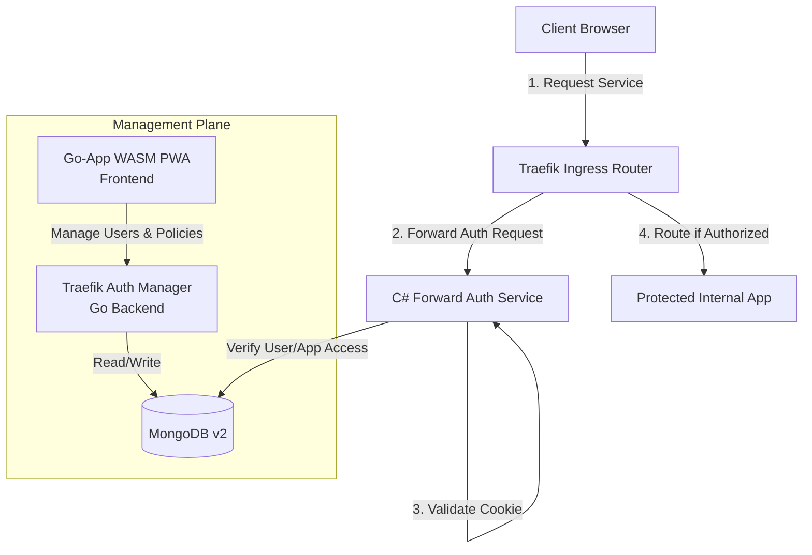
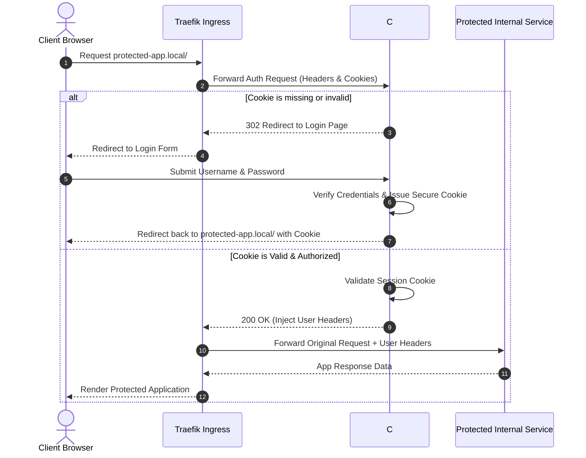
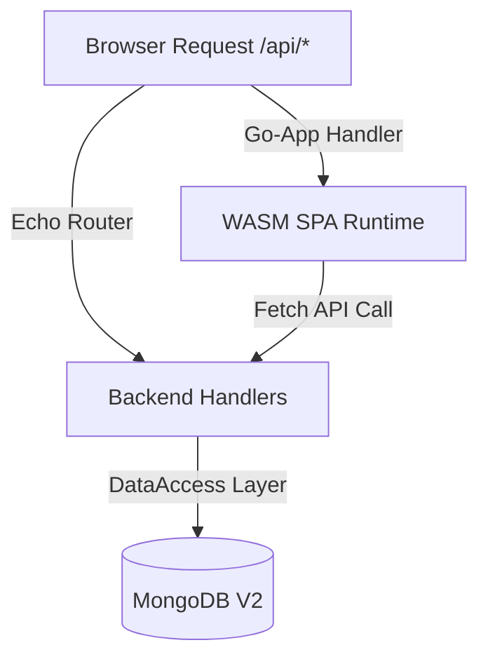

As developers, we often deploy incredible open-source tools or internal services that, unfortunately, lack built-in authentication. Leaving these dashboards exposed isn't an option, and configuring a massive identity provider for a few lightweight internal tools can feel like overkill.  
To solve this for my home lab and internal tools, I decided to dive into **Traefik’s Forward Authentication** ecosystem. I built a custom, two-part solution:

1. A **C# .NET Core service** that handles the core cookie-based authentication handshake.  
2. A **Go-based WebAssembly (WASM) Progressive Web App (PWA)** to easily manage users, credentials, and application access.

Here is an inside look at the architecture, data flow, and tech stack behind this project.

## **🏗️ Architectural Overview**

The entire ecosystem is split into two primary components protecting our internal services: the lightweight authentication gatekeeper and the full-stack management plane.



## **🔄 Deep Dive: The Forward Authentication Data Flow**

Traefik’s ForwardAuth middleware acts as a gatekeeper. Before Traefik routes any incoming traffic to a protected internal service, it forwards the request headers to our custom authentication service.  
If our service responds with a 200 OK, Traefik allows the traffic through. If it responds with a 401 Unauthorized or a 302 Redirect, Traefik intercepts the workflow and passes that response back to the user.  
Here is exactly how the data flows when a user attempts to access a protected application:



## **🛠️ The Tech Stack Components**

### **1. The Gatekeeper: C# Forward Auth Service**

The core authentication logic is handled by a streamlined C# helper application.

* **The Job**: Intercepting incoming Traefik requests, managing a secure, cookie-based session state, and serving a clean username/password login form for unauthenticated users.  
* **Why C#?**: It allowed me to leverage robust, production-grade cookie authentication middleware and high-performance HTTP handling out of the box.
* **Source**: You can review or fork the codebase on GitHub at [ajaxe/traefik-forward-auth](https://github.com/ajaxe/traefik-forward-auth).

### **2. The Control Plane: Traefik Auth Manager**

To manage users, update passwords, and control which users can access specific applications, I built a lightweight management dashboard. I chose a unique **Dual-Target Go Compilation** architecture using a single, unified codebase:

* **The Backend API**: Built using the high-performance **Echo Framework (v4)**, connecting to a **MongoDB** data store to hold user access control lists (ACLs) and application definitions.  
* **The Frontend PWA**: A rich, installable, and highly reactive user interface built using **go-app (v10)**, compiled entirely into **WebAssembly (WASM)**.
* **Source**: Explore the implementation framework on GitHub at [ajaxe/traefik-auth-manager](https://github.com/ajaxe/traefik-auth-manager).



By using Go across the entire full stack, I achieved complete type-safety across the network boundary. The exact same data models (complete with JSON and BSON tags) are shared seamlessly between the WASM client running in the browser and the Echo backend server.

## **📦 Containerization & Deployment**

To keep local deployment overhead to an absolute minimum, both applications are designed to build into lean Docker containers using localized workflows.  
For the **C# Forward Auth Service**, the build pipeline is clean and isolated:

```Bash  
docker build . -f build/Dockerfile --network=host --tag apogee-dev/traefik-forward-auth:local
```

For the **Go Auth Manager**, it utilizes Docker BuildKit to rapidly compile both the native Go binary backend and the WebAssembly frontend package assets simultaneously:

```Bash  
# Using BuildKit to spin up the dual-target app  
DOCKER_BUILDKIT=1 docker build . --network=host --tag apogee-dev/traefik-auth-manager:local
```

## **💡 Lessons Learned**

* **Traefik Flexibility**: Traefik's forward authentication middleware is incredibly powerful. By delegating the security boundary to a custom service, you can turn basic internal utilities into enterprise-grade secured endpoints without modifying a single line of the underlying application's source code.  
* **Go + WASM is Production Ready**: Building a PWA frontend in Go using go-app was an incredibly refreshing experience. Eliminating the Javascript/Typescript build step and sharing pure Go structs between the frontend views and backend database validation saved hours of boilerplate refactoring.